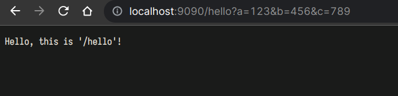
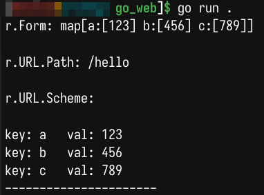

# GO WEB 基础


- [GO WEB 基础](#go-web-基础)
	- [入门代码](#入门代码)
	- [处理表单内容](#处理表单内容)


## 入门代码

```go
package main

import (
	"fmt"
	"log"
	"net/http"
	"strings"
)

func sayhello(w http.ResponseWriter, r *http.Request) { // w,r 分别是输出到网页的文件指针，和从访问参数得到的信息
	r.ParseForm()                  //解析参数，默认是不会解析的
	fmt.Println("r.Form:", r.Form) //这些信息是输出到服务器端的打印信息
	fmt.Println()
	fmt.Println("r.URL.Path:", r.URL.Path) //访问的路径
	fmt.Println()
	fmt.Println("r.URL.Scheme:", r.URL.Scheme) //r.URL.Scheme
	fmt.Println()
	for k, v := range r.Form { //循环输出r.Form
		fmt.Println("key:", k, "  val:", strings.Join(v, ""))
	}
	fmt.Println("----------------------")
	fmt.Fprintf(w, "Hello, this is '/hello'!") //给客户的回复
}

func sayhi(w http.ResponseWriter, r *http.Request) {
	fmt.Fprintf(w, "Hello, this is '/hi'!")
}

func main() {
	http.HandleFunc("/hello", sayhello)               //设置访问的路由,及其处理函数
	http.HandleFunc("/hi", sayhi)                     //设置访问的路由,及其处理函数
	err := http.ListenAndServe("127.0.0.1:9090", nil) //设置监听的端口,并返回错误
	if err != nil {                                   //错误处理
		log.Fatal("ListenAndServe err:", err)
	}
}
```

下图是，在浏览器访问后的输出：





## 处理表单内容

```go
// 登陆处理函数
func login(w http.ResponseWriter, r *http.Request) {
	fmt.Println("method:", r.Method) //获取请求的方法
	r.ParseForm()                    //解析参数，默认是不会解析的
	if r.Method == "GET" {
		t, _ := template.ParseFiles("login.html")
		log.Println(t.Execute(w, nil))
	} else {
		//请求的是登录数据，那么执行登录的逻辑判断
		fmt.Println("username:", r.Form["username"])
		fmt.Println("password:", r.Form["password"])
	}
}


// main函数中，处理
http.HandleFunc("/login", login)
```
```html
<html>
<head>
<title></title>
</head>
<body>
<form action="/login" method="post">
	用户名:<input type="text" name="username"><br>
	密码:<input type="password" name="password"><br>
	<input type="submit" value="登录">
</form>
</body>
<script src="./test.js"></script>
</html>
```